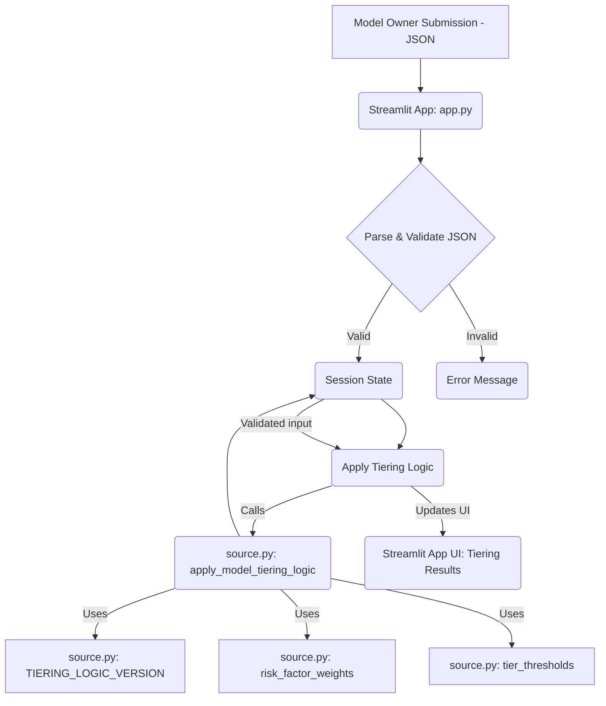

id: 697a3f9c9e22e29762ed3cb1_documentation
summary: Second Line - MRM Lead's Formal Model Tiering & Control Mandate Documentation
feedback link: https://docs.google.com/forms/d/e/1FAIpQLSfWkOK-in_bMMoHSZfcIvAeO58PAH9wrDqcxnJABHaxiDqhSA/viewform?usp=sf_link
environments: Web
status: Published
# QuLab: Streamlit for Formal Model Tiering and Control Mandate

## 1. Introduction to Model Risk Management and the QuLab Application
Duration: 0:05
Welcome to this QuLab codelab! In today's financial landscape, models—especially advanced AI/ML models—are becoming indispensable across various business functions. While they offer immense potential, they also introduce significant risks if not properly governed and managed. This is where **Model Risk Management (MRM)** plays a crucial role. Regulators, such as the Federal Reserve and OCC in the US, have issued guidance like **SR 11-7** ("Guidance on Model Risk Management") to ensure financial institutions effectively manage model risk.

<aside class="positive">
<b>Key Concept: SR 11-7</b>
SR 11-7 emphasizes strong governance, clear policies, independent validation, and comprehensive documentation to manage risks associated with models. It defines a "model" broadly as "a quantitative method, system, or approach that applies statistical, economic, financial, or mathematical theories, techniques, and assumptions to process input data into quantitative estimates."
</aside>

This Streamlit application, "QuLab: Second Line - MRM Lead's Formal Model Tiering & Control Mandate," simulates a critical workflow for an MRM Lead, a role typically found in the "Second Line of Defense" within a financial institution. The application's core purpose is to:
1.  **Ingest Model Submissions**: Receive initial model registration details from Model Owners.
2.  **Apply Formal Tiering Logic**: Objectively assess a model's inherent risk based on predefined enterprise criteria.
3.  **Mandate Required Controls**: Determine the necessary control expectations (e.g., validation rigor, monitoring frequency) corresponding to the assigned risk tier.
4.  **Generate Formal Reports**: Create auditable documentation for governance, compliance, and communication.

<aside class="positive">
<b>Importance of this Application</b>
This application demonstrates how a deterministic, systematic approach to model risk tiering ensures consistency, reduces subjectivity, and aligns model oversight efforts with regulatory expectations (specifically SR 11-7's guidance on proportionality and materiality). It transforms qualitative risk attributes into quantitative scores, enabling transparent and auditable decision-making.
</aside>

The application is built using **Streamlit** for its interactive user interface and relies on a separate `source.py` file for its core business logic, including tiering algorithms, risk factor weights, and control libraries. This separation of concerns promotes modularity and maintainability, allowing developers to easily update the underlying risk logic without altering the UI.

In this codelab, you will:
*   Set up the Streamlit application and its dependencies.
*   Walk through the MRM Lead's workflow step-by-step.
*   Understand the underlying logic (risk scoring, control mapping).
*   Learn how to generate formal reports for model risk governance.

## 2. Setting up the Development Environment
Duration: 0:05

To get started, you'll need Python installed on your system. We recommend using Python 3.8 or newer.

### 2.1. Create Project Files

First, create a new directory for your project and navigate into it:

```bash
mkdir streamlit_mrm_codelab
cd streamlit_mrm_codelab
```

Next, create two Python files: `app.py` (for the Streamlit application) and `source.py` (for the core logic), and one JSON file `model_registration.json` (for sample input).

**`app.py`**
Copy the entire Streamlit application code provided in the problem description into `app.py`:

```python
import streamlit as st
import json
import pandas as pd
import datetime
from io import StringIO

# Import all necessary functions and constants from source.py
from source import TIERING_LOGIC_VERSION, risk_factor_weights, tier_thresholds, control_expectations_library, apply_model_tiering_logic, map_controls_to_tier

#  Page Configuration 
st.set_page_config(page_title="QuLab: Second Line - MRM Lead's Formal Model Tiering & Control Mandate", layout="wide")
st.sidebar.image="https://www.quantuniversity.com/assets/img/logo5.jpg"
st.sidebar.divider()
st.title("QuLab: Second Line - MRM Lead's Formal Model Tiering & Control Mandate")
st.divider()

#  Session State Initialization 
if 'current_page' not in st.session_state:
    st.session_state.current_page = "1) Ingest Model Submission"
if 'uploaded_file_content' not in st.session_state:
    st.session_state.uploaded_file_content = None
if 'model_registration_data' not in st.session_state:
    st.session_state.model_registration_data = None
if 'validation_status' not in st.session_state:
    st.session_state.validation_status = None
if 'validation_error' not in st.session_state:
    st.session_state.validation_error = None
if 'tiering_results' not in st.session_state:
    st.session_state.tiering_results = None
if 'controls_checklist' not in st.session_state:
    st.session_state.controls_checklist = None
if 'mrm_lead_rationale_text' not in st.session_state:
    st.session_state.mrm_lead_rationale_text = ""
if 'download_json_tiering_content' not in st.session_state:
    st.session_state.download_json_tiering_content = ""
if 'download_json_controls_content' not in st.session_state:
    st.session_state.download_json_controls_content = ""
if 'download_md_summary_content' not in st.session_state:
    st.session_state.download_md_summary_content = ""


#  Sidebar Navigation 
with st.sidebar:
    st.title("MRM Lead Workflow")
    # Disable subsequent pages until prior steps are complete
    page_options = [
        "1) Ingest Model Submission",
        "2) Official Tiering",
        "3) Required Controls",
        "4) Export Reports"
    ]
    disabled_pages = []
    if not st.session_state.model_registration_data:
        disabled_pages.extend(["2) Official Tiering", "3) Required Controls", "4) Export Reports"])
    elif not st.session_state.tiering_results:
        disabled_pages.extend(["3) Required Controls", "4) Export Reports"])
    elif not st.session_state.controls_checklist:
        disabled_pages.extend(["4) Export Reports"])

    st.markdown("### Navigation")
    for i, page in enumerate(page_options):
        is_disabled = page in disabled_pages
        if st.button(page, disabled=is_disabled, use_container_width=True, key=f"nav_button_{i}"):
            st.session_state.current_page = page
            st.rerun()

st.header(st.session_state.current_page)


#  Page Content 

# 1) Ingest Model Submission Page
if st.session_state.current_page == "1) Ingest Model Submission":
    st.markdown(f"")
    st.markdown(f"## 1. Reviewing the Submitted Model Registration")
    st.markdown(f"")
    st.markdown(f"As the MRM Lead, your first step is to review the Model Owner's preliminary submission. This initial registration provides critical context about the model's purpose, design, and the owner's self-assessment of its risk. According to SR 11-7 (Section IV: Model Development, Implementation, and Use, page 5), a 'clear statement of purpose' and comprehensive documentation are foundational. While the owner's preliminary tiering is valuable, it is the Second Line's independent assessment that determines the official tier and corresponding controls. This initial review helps you contextualize the model before applying BankCo's formal risk tiering logic.")
    st.markdown(f"")

    uploaded_file = st.file_uploader("Upload Lab 1 Model Registration JSON", type=["json"])

    if uploaded_file is not None:
        file_content = uploaded_file.getvalue().decode("utf-8")
        st.session_state.uploaded_file_content = file_content

        try:
            parsed_data = json.loads(file_content)
            # Basic schema validation for required fields based on source.py's mock_model_inventory structure
            required_keys = [
                "model_id", "model_name", "model_purpose", "model_owner",
                "submission_date", "data_used", "key_attributes_for_tiering",
                "owner_preliminary_assessment"
            ]
            missing_keys = [key for key in required_keys if key not in parsed_data]

            if parsed_data.get("key_attributes_for_tiering") is None or not isinstance(parsed_data["key_attributes_for_tiering"], dict):
                missing_keys.append("key_attributes_for_tiering is missing or invalid")
            if parsed_data.get("owner_preliminary_assessment") is None or not isinstance(parsed_data["owner_preliminary_assessment"], dict):
                missing_keys.append("owner_preliminary_assessment is missing or invalid")
            else:
                if "preliminary_risk_tier" not in parsed_data["owner_preliminary_assessment"]:
                    missing_keys.append("owner_preliminary_assessment.preliminary_risk_tier is missing")


            if missing_keys:
                st.session_state.validation_status = False
                st.session_state.validation_error = f"Error: Missing or invalid required fields in JSON: {', '.join(missing_keys)}"
                st.session_state.model_registration_data = None
            else:
                st.session_state.validation_status = True
                st.session_state.validation_error = None
                st.session_state.model_registration_data = parsed_data
                st.session_state.current_page = "2) Official Tiering" # Auto-advance
                st.rerun()


        except json.JSONDecodeError:
            st.session_state.validation_status = False
            st.session_state.validation_error = "Error: Invalid JSON format. Please upload a valid JSON file."
            st.session_state.model_registration_data = None
    else:
        # Reset state if file is removed
        if st.session_state.model_registration_data is not None:
            st.session_state.model_registration_data = None
            st.session_state.validation_status = None
            st.session_state.validation_error = None
            st.session_state.tiering_results = None
            st.session_state.controls_checklist = None
            st.session_state.mrm_lead_rationale_text = ""


    if st.session_state.validation_status is not None:
        if st.session_state.validation_status:
            st.success("JSON schema validation successful!")
            st.markdown(f"### Model Submitted for Review: **{st.session_state.model_registration_data['model_name']} ({st.session_state.model_registration_data['model_id']})**")
            st.markdown(f"**Model Owner:** {st.session_state.model_registration_data['model_owner']}")
            st.markdown(f"**Submission Date:** {st.session_state.model_registration_data['submission_date']}")
            st.markdown(f"**Model Purpose:** {st.session_state.model_registration_data['model_purpose']}")
            st.markdown(f"**Data Used:** {', '.join(st.session_state.model_registration_data['data_used'])}")
            st.markdown("\n#### Model Owner's Preliminary Self-Assessment:")
            st.markdown(f"- **Preliminary Risk Tier:** {st.session_state.model_registration_data['owner_preliminary_assessment']['preliminary_risk_tier']}")
            st.markdown(f"- **Rationale:** {st.session_state.model_registration_data['owner_preliminary_assessment']['rationale']}")
            st.markdown(f"- **Key Attributes for Tiering:**")
            for attr, desc in st.session_state.model_registration_data['key_attributes_for_tiering'].items():
                st.markdown(f"  - **{attr.replace('_', ' ').title()}**: {desc}")
            st.markdown(f"\n#### Owner Narrative:\n> {st.session_state.model_registration_data['owner_narrative']}")
            st.markdown("")
            st.markdown(f"The output above summarizes the key information provided by the Model Owner for the \"{st.session_state.model_registration_data['model_name']}\" model. As the MRM Lead, you can quickly grasp the model's intent, its critical attributes, and the owner's initial risk perception. This sets the baseline for your independent evaluation. The owner's preliminary tier ({st.session_state.model_registration_data['owner_preliminary_assessment']['preliminary_risk_tier']}) suggests a high-impact model, aligning with the descriptions of `decision_criticality`, `data_sensitivity`, and `regulatory_materiality`. This initial review confirms the model's significance and the need for a rigorous, formal risk assessment, in line with SR 11-7's guidance on tailoring validation rigor to model materiality (Section V, page 9).")
        else:
            st.error(st.session_state.validation_error)
            st.warning("Please upload a valid JSON file to proceed to the next steps.")
    st.markdown(f"")


# 2) Official Tiering Page
if st.session_state.current_page == "2) Official Tiering":
    if not st.session_state.model_registration_data:
        st.warning("Please first ingest a model submission on the 'Ingest Model Submission' page.")
    else:
        st.markdown(f"")
        st.markdown(f"## 3. Defining BankCo's Official Model Risk Tiering Logic")
        st.markdown(f"")
        st.markdown(f"To ensure consistency, transparency, and reproducibility in model risk assessments, BankCo has established a standardized, deterministic model tiering logic. This formal logic, approved by senior management, translates qualitative model attributes into a quantitative risk score and an official Model Risk Tier. This process directly supports SR 11-7's emphasis on strong 'Governance, Policies, and Controls' (Section VI, page 16) by providing a clear, auditable framework for assessing model risk across the enterprise. It minimizes subjectivity and ensures that similar models are tiered consistently.")
        st.markdown(f"")
        st.markdown(r"The total risk score $S$ for a model is calculated as:")
        st.markdown(r"$$ S = \sum_{{i=1}}^{{N}} P_i $$")
        st.markdown(r"where $P_i$ represents the points assigned to the $i$-th risk attribute based on its specific value.")
        st.markdown(f"")

        st.markdown(f"### BankCo's Official Tiering Logic Version: **{TIERING_LOGIC_VERSION}**")
        st.markdown(f"\n#### Risk Factor Weights/Points:")
        for factor, values in risk_factor_weights.items():
            st.markdown(f"**- {factor.replace('_', ' ').title()}**:")
            for value, points in values.items():
                st.markdown(f"  - _{value}_: {points} points")

        st.markdown(f"\n#### Official Risk Tier Thresholds:")
        for tier, thresholds in tier_thresholds.items():
            st.markdown(r"**- " + tier + "**: Score $\\ge$ " + str(thresholds['min_score']) + (" and < " + str(thresholds['max_score']) if thresholds['max_score'] != float('inf') else ""))
        st.markdown(f"")

        st.markdown(f"")
        st.markdown(f"## 4. Applying the Formal Model Risk Tiering Algorithm")
        st.markdown(f"")
        st.markdown(f"Now, as the MRM Lead, you will apply BankCo's official, deterministic tiering logic to the \"{st.session_state.model_registration_data['model_name']}\" model. This is a critical step to independently calculate the model's inherent risk score and assign its authoritative tier. This exercise directly supports SR 11-7's core principle that \"The rigor and sophistication of validation should be commensurate with the bank's overall use of models, the complexity and materiality of its models\" (Section V, page 9). By objectively tiering the model, you ensure that the subsequent model validation activities, monitoring efforts, and governance overhead are appropriately scaled to the actual risk posed by the model. This prevents both under- and over-scoping of model risk management resources.")
        st.markdown(f"")


        if st.button("Recompute Official Tier", key="recompute_tier_button") or st.session_state.tiering_results is None:
            # Function invocation from source.py
            st.session_state.tiering_results = apply_model_tiering_logic(
                st.session_state.model_registration_data,
                risk_factor_weights,
                tier_thresholds,
                TIERING_LOGIC_VERSION
            )
            st.session_state.mrm_lead_rationale_text = st.session_state.tiering_results['mrm_lead_rationale_plain_english']
            # Auto-advance after initial computation
            st.session_state.current_page = "3) Required Controls"
            st.rerun()


        if st.session_state.tiering_results:
            tr = st.session_state.tiering_results
            st.markdown("### Official Model Risk Tiering Results")
            col1, col2 = st.columns(2)
            with col1:
                st.metric(label="Official Risk Score", value=f"**{tr['official_risk_score']}**")
            with col2:
                st.metric(label="Official Risk Tier", value=f"**{tr['official_risk_tier']}**")

            st.markdown(f"- **Model ID:** {tr['model_id']}")
            st.markdown(f"- **Model Name:** {tr['model_name']}")
            st.markdown(f"- **Tiering Logic Version:** {tr['tiering_logic_version']}")
            st.markdown(f"- **Date Tiered:** {tr['date_tiered']}")
            st.markdown(f"- **Tiered By:** {tr['tiered_by']}")

            st.markdown("\n#### Score Breakdown by Factor:")
            score_breakdown_df = pd.DataFrame([
                {"Factor": k.replace('_', ' ').title(), "Value Matched": v["value_matched"], "Points": v["points"]}
                for k, v in tr['score_breakdown'].items()
            ])
            st.dataframe(score_breakdown_df, hide_index=True, use_container_width=True)

            st.markdown("\n#### Tiering Decision Rationale:")
            st.markdown(tr['mrm_lead_rationale_plain_english'])

            st.markdown("\n#### Comparison with Model Owner's Preliminary Tier:")
            owner_preliminary_tier = st.session_state.model_registration_data['owner_preliminary_assessment']['preliminary_risk_tier']
            if tr['official_risk_tier'] == owner_preliminary_tier:
                st.success(f"The official tiering **matches** the Model Owner's preliminary assessment of **{owner_preliminary_tier}**. This indicates strong alignment in risk perception.")
            else:
                st.warning(f"The official tiering assigned **{tr['official_risk_tier']}**, which **differs** from the Model Owner's preliminary assessment of **{owner_preliminary_tier}**. Further discussion with the Model Owner may be warranted to align understanding of risk factors.")
            
            st.markdown("")
            st.markdown(f"The output confirms the \"{st.session_state.model_registration_data['model_name']}\" model has been officially assigned a **{tr['official_risk_tier']}** risk, with a score of **{tr['official_risk_score']}**. This {('aligns with' if tr['official_risk_tier'] == owner_preliminary_tier else 'differs from')} the Model Owner's preliminary assessment, which is a {('positive' if tr['official_risk_tier'] == owner_preliminary_tier else 'point for discussion')} indicator of shared risk understanding. The detailed score breakdown provides transparency on how each attribute contributed to the final score, justifying the decision. For example, `Decision Criticality` ({tr['score_breakdown'].get('decision_criticality', {}).get('points', 0)} points) and `Regulatory Materiality` ({tr['score_breakdown'].get('regulatory_materiality', {}).get('points', 0)} points) significantly impact the overall risk.")
            st.markdown(f"")
            st.markdown(f"As the MRM Lead, this result signals that the \"{st.session_state.model_registration_data['model_name']}\" is indeed a high-impact model requiring the most stringent controls. This objective, quantitative assessment is crucial for allocating appropriate resources and ensuring compliance with SR 11-7's guidance on tailoring model validation rigor to its risk profile (Section V, page 9: \"The rigor and sophistication of validation should be commensurate with the bank's overall use of models, the complexity and materiality of its models\").")


# 3) Required Controls Page
if st.session_state.current_page == "3) Required Controls":
    if not st.session_state.tiering_results:
        st.warning("Please first complete the 'Official Tiering' process.")
    else:
        st.markdown(f"")
        st.markdown(f"## 5. Establishing Minimum Required Control Expectations")
        st.markdown(f"")
        st.markdown(f"With the official Model Risk Tier now assigned, your next responsibility as the MRM Lead is to formally establish the minimum required control expectations for the \"{st.session_state.model_registration_data['model_name']}\" model. This is a direct implementation of SR 11-7's Section VI: Governance, Policies, and Controls (page 16), which emphasizes that a robust governance framework includes \"policies defining relevant risk management activities\" and \"procedures that implement those policies.\" By mapping controls to the assigned tier, BankCo ensures that higher-risk models, like the newly tiered \"{st.session_state.model_registration_data['model_name']}\" model, receive the most stringent oversight, including deep independent validation, frequent performance monitoring, and rigorous documentation standards. This systematic approach ensures adequate safeguards are in place and clearly communicates responsibilities to the Model Owner and other stakeholders.")
        st.markdown(f"")

        # Function invocation from source.py
        if st.session_state.controls_checklist is None or \
           st.session_state.controls_checklist.get('assigned_tier') != st.session_state.tiering_results['official_risk_tier']:
            st.session_state.controls_checklist = map_controls_to_tier(
                st.session_state.tiering_results['official_risk_tier'],
                control_expectations_library,
                st.session_state.tiering_results['model_id']
            )
            # Auto-advance after initial computation
            st.session_state.current_page = "4) Export Reports"
            st.rerun()


        if st.session_state.controls_checklist:
            cc = st.session_state.controls_checklist
            st.markdown("### Minimum Required Control Expectations for the Model")
            st.markdown(f"**Model ID:** {cc['model_id']}")
            st.markdown(f"**Assigned Tier:** **{cc['assigned_tier']}**")

            st.markdown("\n#### Detailed Control Checklist:")
            controls_df = pd.DataFrame(cc['required_controls'])
            
            # Group controls by category (Validation, Monitoring, Documentation, Governance, Data, Audit)
            def categorize_control(control_name):
                if "Validation" in control_name or "validation" in control_name: return "Validation Controls"
                if "Monitoring" in control_name or "monitoring" in control_name: return "Monitoring Controls"
                if "Documentation" in control_name or "documentation" in control_name: return "Documentation Controls"
                if "Management" in control_name or "Approval" in control_name or "Oversight" in control_name: return "Governance Controls"
                if "Data Quality" in control_name: return "Data Quality & Governance"
                if "Audit" in control_name: return "Audit & Compliance"
                return "General Controls"

            if not controls_df.empty:
                controls_df['Category'] = controls_df['control_name'].apply(categorize_control)
                categories = ["Validation Controls", "Monitoring Controls", "Documentation Controls",
                              "Governance Controls", "Data Quality & Governance", "Audit & Compliance", "General Controls"]
                
                for category in categories:
                    category_df = controls_df[controls_df['Category'] == category]
                    if not category_df.empty:
                        with st.expander(f"**{category}**"):
                            st.dataframe(category_df[['control_id', 'control_name', 'description', 'frequency', 'owner_role']], hide_index=True, use_container_width=True)
            else:
                st.info("No specific controls found for this tier in the library.")

            st.markdown("\n#### Summary of Control Expectations:")
            st.markdown(cc['control_expectations_summary'])

            st.markdown("")
            st.markdown(f"The output presents the comprehensive list of controls mandated for the \"{st.session_state.model_registration_data['model_name']}\" model, now officially designated as {st.session_state.tiering_results['official_risk_tier']} risk. This includes requirements for full scope independent validation, frequent performance monitoring, rigorous documentation, senior management approval, strict data governance, and regular internal audit reviews.")
            st.markdown(f"")
            st.markdown(f"For the MRM Lead, this serves as the formal control mandate. It clearly outlines the high bar for oversight required for this model, aligning directly with SR 11-7's expectations for models with significant materiality. This checklist will be communicated to the Model Owner and relevant support functions, guiding their ongoing responsibilities and ensuring appropriate allocation of resources for validation and monitoring. This ensures \"effective challenge\" and management of model risk (SR 11-7, Section III, page 4).")


# 4) Export Reports Page
if st.session_state.current_page == "4) Export Reports":
    if not st.session_state.controls_checklist:
        st.warning("Please first complete the 'Required Controls' process.")
    else:
        st.markdown(f"")
        st.markdown(f"## 6. Generating the Formal Tiering Decision Report")
        st.markdown(f"")
        st.markdown(f"The final step in your workflow as the MRM Lead is to compile and export the formal Tiering Decision Report. This comprehensive report, incorporating the model metadata, the calculated risk score, the assigned official tier, the plain-English rationale, and the associated control expectations, is a critical deliverable. It serves as the official record for internal governance, audit, and regulatory bodies, demonstrating BankCo's adherence to SR 11-7 guidance on \"Documentation\" (Section VI, page 21). Effective documentation ensures transparency, reproducibility, and clear communication of model risk decisions to all stakeholders, including the Model Owner and AI Program Lead. It provides an auditable trail and cements the clarity needed for ongoing model risk management.")
        st.markdown(f"")

        st.markdown("### Review and Finalize Rationale")
        # Ensure the text area is always populated with the current rationale from session state
        st.session_state.mrm_lead_rationale_text = st.text_area(
            "MRM Lead's Official Rationale (editable):",
            value=st.session_state.mrm_lead_rationale_text,
            height=200
        )

        st.markdown("### Preview and Download Reports")

        model_id_for_reports = st.session_state.model_registration_data['model_id']
        model_name_for_reports = st.session_state.model_registration_data['model_name']
        official_risk_tier_for_reports = st.session_state.tiering_results['official_risk_tier']
        official_risk_score_for_reports = st.session_state.tiering_results['official_risk_score']
        tiering_logic_version_for_reports = st.session_state.tiering_results['tiering_logic_version']
        date_tiered_for_reports = st.session_state.tiering_results['date_tiered']
        tiered_by_for_reports = st.session_state.tiering_results['tiered_by']
        owner_preliminary_tier_for_reports = st.session_state.model_registration_data['owner_preliminary_assessment']['preliminary_risk_tier']
        model_purpose_for_reports = st.session_state.model_registration_data['model_purpose']
        model_owner_for_reports = st.session_state.model_registration_data['model_owner']
        submission_date_for_reports = st.session_state.model_registration_data['submission_date']


        # Prepare risk_tiering.json content
        tiering_results_for_download = st.session_state.tiering_results.copy()
        tiering_results_for_download['mrm_lead_rationale_plain_english'] = st.session_state.mrm_lead_rationale_text
        st.session_state.download_json_tiering_content = json.dumps(tiering_results_for_download, indent=4)

        st.subheader(f"1. `risk_tiering.json`")
        st.json(json.loads(st.session_state.download_json_tiering_content)) # Display nicely
        st.download_button(
            label="Download Risk Tiering JSON",
            data=st.session_state.download_json_tiering_content,
            file_name=f"{model_id_for_reports}_risk_tiering.json",
            mime="application/json",
            key="download_tiering_json"
        )

        # Prepare required_controls_checklist.json content
        controls_checklist_for_download = st.session_state.controls_checklist.copy()
        st.session_state.download_json_controls_content = json.dumps(controls_checklist_for_download, indent=4)

        st.subheader(f"2. `required_controls_checklist.json`")
        st.json(json.loads(st.session_state.download_json_controls_content)) # Display nicely
        st.download_button(
            label="Download Required Controls JSON",
            data=st.session_state.download_json_controls_content,
            file_name=f"{model_id_for_reports}_required_controls_checklist.json",
            mime="application/json",
            key="download_controls_json"
        )

        # Prepare executive_summary.md content
        md_summary_content = f"""# Model Risk Tiering Decision Report: {model_id_for_reports} - {model_name_for_reports}

**Date:** {date_tiered_for_reports}
**Tiered By:** {tiered_by_for_reports}


## 1. Executive Summary

The **{model_name_for_reports}** (`{model_id_for_reports}`) has undergone formal risk tiering by the Model Risk Management (MRM) team at BankCo. Based on the enterprise's official tiering logic (version: {tiering_logic_version_for_reports}), the model has been assigned an **Official Risk Tier of {official_risk_tier_for_reports}** with a total risk score of **{official_risk_score_for_reports}**.

This tiering {'aligns with' if official_risk_tier_for_reports == owner_preliminary_tier_for_reports else 'differs from'} the Model Owner's preliminary assessment and signifies that the model carries a {official_risk_tier_for_reports.lower()} level of inherent risk, necessitating the most stringent oversight and control measures as per SR 11-7 guidance.


## 2. Model Overview (from Owner Submission)

- **Model Purpose:** {model_purpose_for_reports}
- **Model Owner:** {model_owner_for_reports}
- **Submission Date:** {submission_date_for_reports}
- **Model Owner's Preliminary Tier:** {owner_preliminary_tier_for_reports}


## 3. Official Tiering Decision

**Official Risk Score:** {official_risk_score_for_reports}
**Official Risk Tier:** {official_risk_tier_for_reports}
**Tiering Logic Version:** {tiering_logic_version_for_reports}

### Score Breakdown:
"""
        for factor, details in tiering_results_for_download['score_breakdown'].items():
            md_summary_content += f"- **{factor.replace('_', ' ').title()}**: '{details['value_matched']}' contributing {details['points']} points.\n"
        
        md_summary_content += f"""
### MRM Lead Rationale:
{st.session_state.mrm_lead_rationale_text}


## 4. Minimum Required Control Expectations (Based on Official Tier)

Based on the **{official_risk_tier_for_reports}** assignment, the following controls are mandated for the **{model_name_for_reports}**:

"""
        controls_summary_df = pd.DataFrame(controls_checklist_for_download['required_controls'])
        if not controls_summary_df.empty:
            md_summary_content += controls_summary_df[['control_id', 'control_name', 'description', 'frequency', 'owner_role']].to_markdown(index=False)
        else:
            md_summary_content += "No specific controls found for this tier in the library.\n"

        md_summary_content += f"""
### Control Expectations Summary:
{controls_checklist_for_download['control_expectations_summary']}


This report serves as the formal documentation of the model's risk tier and the corresponding control requirements, enabling consistent model risk management and compliance with regulatory expectations.
"""
        st.session_state.download_md_summary_content = md_summary_content

        st.subheader(f"3. `executive_summary.md`")
        st.markdown(st.session_state.download_md_summary_content)
        st.download_button(
            label="Download Executive Summary MD",
            data=st.session_state.download_md_summary_content,
            file_name=f"{model_id_for_reports}_executive_summary.md",
            mime="text/markdown",
            key="download_summary_md"
        )
        
        st.markdown("")
        st.markdown(f"The system has successfully prepared the three required artifacts for download: `{model_id_for_reports}_risk_tiering.json`, `{model_id_for_reports}_required_controls_checklist.json`, and `{model_id_for_reports}_executive_summary.md`.")
        st.markdown(f"")
        st.markdown(f"As the MRM Lead, these exportable files are your concrete deliverables. The JSON files provide structured, machine-readable data for integration into BankCo's enterprise model inventory systems and for potential automated downstream processes (e.g., in Lab 3 for reproducibility or compliance checks). The Markdown `executive_summary.md` offers a human-readable, plain-English summary for communication to Model Owners, AI Program Leads, and senior management. This report ensures transparency, consistency, and a clear audit trail for the formal model risk tiering process, fully aligning with the comprehensive documentation and governance requirements outlined in SR 11-7 (Section VI, page 16, and Section VII, page 21). This completes your formal assessment and provides the necessary foundation for the ongoing management of the \"{model_name_for_reports}\" model's risk.")
```

**`source.py`**
Create a file named `source.py` in the same directory and paste the following code:

```python
# source.py
import datetime

TIERING_LOGIC_VERSION = "BankCo-V1.0.0"

risk_factor_weights = {
    "decision_criticality": {
        "High": 50,
        "Medium": 30,
        "Low": 10
    },
    "data_sensitivity": {
        "Confidential": 40,
        "Proprietary": 20,
        "Public": 5
    },
    "regulatory_materiality": {
        "High": 60,
        "Medium": 35,
        "Low": 15
    },
    "model_complexity": {
        "Complex": 30,
        "Moderate": 15,
        "Simple": 5
    },
    "financial_impact": {
        "Significant": 50,
        "Moderate": 25,
        "Minor": 10
    }
}

tier_thresholds = {
    "Tier 1 (High Risk)": {"min_score": 150, "max_score": float('inf')},
    "Tier 2 (Moderate Risk)": {"min_score": 80, "max_score": 149},
    "Tier 3 (Low Risk)": {"min_score": 0, "max_score": 79}
}

control_expectations_library = {
    "Tier 1 (High Risk)": [
        {"control_id": "T1C001", "control_name": "Full Scope Independent Validation", "description": "Comprehensive independent review of model design, data, implementation, and performance, performed by MRM or external party.", "frequency": "Annually or upon significant change", "owner_role": "MRM/Validation Lead"},
        {"control_id": "T1C002", "control_name": "Frequent Performance Monitoring", "description": "Continuous tracking of model performance, stability, and data input quality with quarterly reporting.", "frequency": "Monthly/Quarterly", "owner_role": "Model Owner"},
        {"control_id": "T1C003", "control_name": "Robust Documentation", "description": "Complete documentation including Model Development Document, Validation Report, and Ongoing Monitoring Report.", "frequency": "Ongoing", "owner_role": "Model Owner"},
        {"control_id": "T1C004", "control_name": "Senior Management Approval", "description": "Model approval required by the Model Governance Committee or equivalent senior management body.", "frequency": "Initial & Revalidation", "owner_role": "Model Governance Committee"},
        {"control_id": "T1C005", "control_name": "Data Quality & Governance", "description": "Strict data lineage, quality checks, and governance framework for all model inputs and outputs.", "frequency": "Ongoing", "owner_role": "Data Steward/Model Owner"},
        {"control_id": "T1C006", "control_name": "Internal Audit Review", "description": "Subject to periodic internal audit review of model risk management processes.", "frequency": "Biennially", "owner_role": "Internal Audit"}
    ],
    "Tier 2 (Moderate Risk)": [
        {"control_id": "T2C001", "control_name": "Targeted Independent Validation", "description": "Independent review focusing on key risk areas of model design and performance, performed by MRM.", "frequency": "Biennially or upon significant change", "owner_role": "MRM/Validation Lead"},
        {"control_id": "T2C002", "control_name": "Regular Performance Monitoring", "description": "Regular tracking of model performance and stability with semi-annual reporting.", "frequency": "Semi-Annually", "owner_role": "Model Owner"},
        {"control_id": "T2C003", "control_name": "Standard Documentation", "description": "Standard documentation including Model Development Document and ongoing monitoring reports.", "frequency": "Ongoing", "owner_role": "Model Owner"},
        {"control_id": "T2C004", "control_name": "Departmental Management Approval", "description": "Model approval required by relevant departmental senior management.", "frequency": "Initial & Revalidation", "owner_role": "Department Head"},
        {"control_id": "T2C005", "control_name": "Basic Data Quality Checks", "description": "Ensuring basic data quality and integrity for model inputs.", "frequency": "Ongoing", "owner_role": "Model Owner"}
    ],
    "Tier 3 (Low Risk)": [
        {"control_id": "T3C001", "control_name": "Annual Review", "description": "Annual review by Model Owner to confirm model appropriateness and performance.", "frequency": "Annually", "owner_role": "Model Owner"},
        {"control_id": "T3C002", "control_name": "Essential Documentation", "description": "Essential documentation outlining model purpose, methodology, and usage.", "frequency": "Initial", "owner_role": "Model Owner"}
    ]
}


def apply_model_tiering_logic(model_data, weights, thresholds, logic_version):
    """
    Applies the official model tiering logic to calculate a risk score and assign a tier.
    """
    model_id = model_data['model_id']
    model_name = model_data['model_name']
    key_attributes = model_data['key_attributes_for_tiering']

    total_score = 0
    score_breakdown = {}
    rationale_components = []

    for factor, factor_weights in weights.items():
        attribute_value = key_attributes.get(factor)
        if attribute_value:
            points = factor_weights.get(attribute_value, 0)
            total_score += points
            score_breakdown[factor] = {
                "value_matched": attribute_value,
                "points": points
            }
            rationale_components.append(f"'{attribute_value}' for {factor.replace('_', ' ').title()} ({points} points)")
        else:
            score_breakdown[factor] = {
                "value_matched": "N/A",
                "points": 0
            }

    official_risk_tier = "Unassigned"
    for tier, score_range in thresholds.items():
        if score_range['min_score'] <= total_score <= score_range['max_score']:
            official_risk_tier = tier
            break
    
    # Construct a plain English rationale
    if rationale_components:
        rationale_plain_english = f"The model's official risk score of {total_score} is derived from the following attributes: {', '.join(rationale_components)}. "
    else:
        rationale_plain_english = "The model's risk score could not be fully calculated due to missing key attributes. "
        
    rationale_plain_english += f"This score falls within the range for '{official_risk_tier}'. The specific contributing factors include: "
    for factor, details in score_breakdown.items():
        if details['points'] > 0:
            rationale_plain_english += f"'{details['value_matched']}' for {factor.replace('_', ' ').title()} contributing {details['points']} points; "
    rationale_plain_english = rationale_plain_english.strip('; ') + "."

    return {
        "model_id": model_id,
        "model_name": model_name,
        "official_risk_score": total_score,
        "official_risk_tier": official_risk_tier,
        "tiering_logic_version": logic_version,
        "date_tiered": datetime.date.today().isoformat(),
        "tiered_by": "MRM Lead",
        "score_breakdown": score_breakdown,
        "mrm_lead_rationale_plain_english": rationale_plain_english
    }

def map_controls_to_tier(official_tier, controls_library, model_id):
    """
    Maps required controls based on the official model risk tier.
    """
    required_controls = controls_library.get(official_tier, [])
    
    summary_text = f"Based on the official assignment of **{official_tier}** risk to model `{model_id}`, the following control expectations are mandated:\n"
    if "Tier 1" in official_tier:
        summary_text += "- **Full Scope Independent Validation**: Comprehensive review (design, data, implementation, performance).\n"
        summary_text += "- **Frequent Performance Monitoring**: Continuous tracking with quarterly reporting.\n"
        summary_text += "- **Robust Documentation**: Complete suite of development, validation, and monitoring reports.\n"
        summary_text += "- **Senior Management Approval**: Required by Model Governance Committee.\n"
        summary_text += "- **Strict Data Quality & Governance**: Comprehensive lineage, quality checks, and governance.\n"
        summary_text += "- **Internal Audit Review**: Subject to periodic internal audit.\n"
    elif "Tier 2" in official_tier:
        summary_text += "- **Targeted Independent Validation**: Focused review of key risk areas.\n"
        summary_text += "- **Regular Performance Monitoring**: Tracking with semi-annual reporting.\n"
        summary_text += "- **Standard Documentation**: Development and monitoring reports.\n"
        summary_text += "- **Departmental Management Approval**: Required by relevant department head.\n"
        summary_text += "- **Basic Data Quality Checks**: Ensuring integrity of inputs.\n"
    elif "Tier 3" in official_tier:
        summary_text += "- **Annual Review**: By Model Owner to confirm appropriateness.\n"
        summary_text += "- **Essential Documentation**: Outlining purpose, methodology, usage.\n"
    else:
        summary_text += "No specific control expectations defined for this tier in the library."


    return {
        "model_id": model_id,
        "assigned_tier": official_tier,
        "required_controls": required_controls,
        "control_expectations_summary": summary_text
    }
```

**`model_registration.json`**
Create a file named `model_registration.json` in the same directory and paste the following content. This file represents a sample model submission from a Model Owner.

```json
{
  "model_id": "ML-CRM-001",
  "model_name": "Customer Churn Prediction Model",
  "model_purpose": "Predict customer churn probability to inform retention strategies and personalized offers.",
  "model_owner": "Alice Smith, Head of Marketing Analytics",
  "submission_date": "2023-10-26",
  "data_used": ["customer_demographics", "transaction_history", "engagement_data", "sentiment_analysis"],
  "owner_preliminary_assessment": {
    "preliminary_risk_tier": "Tier 1 (High Risk)",
    "rationale": "High impact on revenue, uses sensitive customer data, and directly influences critical business decisions related to customer retention."
  },
  "key_attributes_for_tiering": {
    "decision_criticality": "High",
    "data_sensitivity": "Confidential",
    "regulatory_materiality": "High",
    "model_complexity": "Complex",
    "financial_impact": "Significant"
  },
  "owner_narrative": "This model is crucial for our Q4 customer retention initiatives. It leverages a vast array of customer data points to identify at-risk customers with high accuracy. The model's predictions directly inform the allocation of significant marketing budget towards retention campaigns. We believe its impact on revenue and reliance on sensitive customer information warrants a 'High Risk' classification, and we are committed to ensuring its robustness and ethical use."
}
```

### 2.2. Install Dependencies

Install the necessary Python libraries using pip:

```bash
pip install streamlit pandas
```

### 2.3. Run the Application

Once the files are created and dependencies are installed, run the Streamlit application from your terminal:

```bash
streamlit run app.py
```

This command will open a new tab in your web browser displaying the Streamlit application.

## 3. Ingesting the Model Submission
Duration: 0:10

As an MRM Lead, your first task is to review the initial model submission from the Model Owner. This provides essential context and the owner's preliminary self-assessment.

### 3.1. Understanding the "Ingest Model Submission" Page

Navigate to the "1) Ingest Model Submission" page in the sidebar (it should be the default page).

This page features a `st.file_uploader` widget, allowing you to upload the model registration details in JSON format. The application performs basic validation to ensure the JSON structure contains the expected fields.

The Streamlit application code for this page looks like this:

```python
# ... (imports and session state initialization) ...

# 1) Ingest Model Submission Page
if st.session_state.current_page == "1) Ingest Model Submission":
    # ... markdown content ...

    uploaded_file = st.file_uploader("Upload Lab 1 Model Registration JSON", type=["json"])

    if uploaded_file is not None:
        file_content = uploaded_file.getvalue().decode("utf-8")
        st.session_state.uploaded_file_content = file_content

        try:
            parsed_data = json.loads(file_content)
            # Basic schema validation for required fields
            required_keys = [
                "model_id", "model_name", "model_purpose", "model_owner",
                "submission_date", "data_used", "key_attributes_for_tiering",
                "owner_preliminary_assessment"
            ]
            missing_keys = [key for key in required_keys if key not in parsed_data]

            # Additional checks for nested dictionaries
            if parsed_data.get("key_attributes_for_tiering") is None or not isinstance(parsed_data["key_attributes_for_tiering"], dict):
                missing_keys.append("key_attributes_for_tiering is missing or invalid")
            if parsed_data.get("owner_preliminary_assessment") is None or not isinstance(parsed_data["owner_preliminary_assessment"], dict):
                missing_keys.append("owner_preliminary_assessment is missing or invalid")
            else:
                if "preliminary_risk_tier" not in parsed_data["owner_preliminary_assessment"]:
                    missing_keys.append("owner_preliminary_assessment.preliminary_risk_tier is missing")

            if missing_keys:
                st.session_state.validation_status = False
                st.session_state.validation_error = f"Error: Missing or invalid required fields in JSON: {', '.join(missing_keys)}"
                st.session_state.model_registration_data = None
            else:
                st.session_state.validation_status = True
                st.session_state.validation_error = None
                st.session_state.model_registration_data = parsed_data
                st.session_state.current_page = "2) Official Tiering" # Auto-advance
                st.rerun()

        except json.JSONDecodeError:
            st.session_state.validation_status = False
            st.session_state.validation_error = "Error: Invalid JSON format. Please upload a valid JSON file."
            st.session_state.model_registration_data = None
    # ... (displaying validation status and data) ...
```

This code snippet demonstrates:
*   Using `st.file_uploader` to accept JSON files.
*   Decoding the file content and parsing it with `json.loads`.
*   Performing simple validation by checking for the presence of `required_keys`.
*   Storing the parsed data and validation status in `st.session_state` for persistence across page reruns.
*   Automatically advancing to the next page (`2) Official Tiering`) upon successful validation using `st.rerun()`.

### 3.2. Uploading the Sample Model Registration

1.  Click the "Upload Lab 1 Model Registration JSON" button.
2.  Select the `model_registration.json` file you created in Step 2.

Upon successful upload, the application will display a summary of the model, including its purpose, owner, and the owner's preliminary risk assessment. You will also notice that the sidebar navigation will automatically advance to "2) Official Tiering."

<aside class="positive">
This initial review is vital for context. While the Model Owner's preliminary assessment is a good starting point, the MRM Lead's role is to conduct an independent, objective assessment using standardized, enterprise-wide criteria.
</aside>

## 4. Understanding BankCo's Official Tiering Logic
Duration: 0:15

Now that the model submission is ingested, the next step for the MRM Lead is to apply BankCo's formal tiering logic. Before applying it, let's understand how this logic is structured.

### 4.1. The Role of `source.py`
The core of BankCo's tiering logic resides in the `source.py` file. This separation ensures that the business rules are decoupled from the Streamlit UI, making the system more robust and easier to update.

Here's an overview of the key components within `source.py` that define the tiering logic:

```python
# source.py (excerpts)

# Versioning the logic is crucial for auditability
TIERING_LOGIC_VERSION = "BankCo-V1.0.0"

# Weights/points assigned to different values of risk factors
risk_factor_weights = {
    "decision_criticality": {
        "High": 50,
        "Medium": 30,
        "Low": 10
    },
    "data_sensitivity": {
        "Confidential": 40,
        "Proprietary": 20,
        "Public": 5
    },
    # ... other factors ...
}

# Score ranges that define each risk tier
tier_thresholds = {
    "Tier 1 (High Risk)": {"min_score": 150, "max_score": float('inf')},
    "Tier 2 (Moderate Risk)": {"min_score": 80, "max_score": 149},
    "Tier 3 (Low Risk)": {"min_score": 0, "max_score": 79}
}

# ... (control_expectations_library and functions) ...
```

### 4.2. The Risk Score Calculation
BankCo's formal tiering logic calculates a total risk score for a model by summing points assigned to various risk attributes. The formula is a simple summation:

$$ S = \sum_{i=1}^{N} P_i $$

Where:
*   $S$ is the total inherent risk score for the model.
*   $N$ is the number of identified risk attributes (e.g., decision criticality, data sensitivity).
*   $P_i$ represents the points assigned to the $i$-th risk attribute, based on its specific value (e.g., 'High' for decision criticality gives 50 points).

### 4.3. Architecture of the Tiering Process

The following diagram illustrates the high-level architecture of the application and the tiering process:



**Explanation:**
1.  **Model Owner Submission (JSON)**: The process starts with a JSON file detailing the model and its attributes.
2.  **Streamlit App (`app.py`)**: This is the user interface where the MRM Lead interacts.
3.  **Parse & Validate JSON**: The app reads the uploaded JSON and performs basic schema validation.
4.  **Session State**: Validated model data is stored in Streamlit's session state, making it available across different pages and reruns.
5.  **Apply Tiering Logic**: When triggered, the Streamlit app calls the core tiering function.
6.  **`source.py: apply_model_tiering_logic`**: This function, defined in `source.py`, takes the model data and the predefined weights and thresholds as input.
7.  **`source.py` Constants**: It utilizes `TIERING_LOGIC_VERSION`, `risk_factor_weights`, and `tier_thresholds` to perform the calculation.
8.  **Updates Session State**: The results (score, tier, rationale) are stored back in session state.
9.  **Streamlit App UI**: The UI then displays these results to the user.
10. **Error Message**: If the JSON is invalid, an error message is displayed.

This modular design allows `source.py` to act as a backend service for business logic, while `app.py` handles the presentation and user interaction.

## 5. Applying the Formal Model Risk Tiering Algorithm
Duration: 0:10

Now that you understand the underlying logic, let's apply it using the Streamlit application.

### 5.1. Applying the Tiering Logic

If you successfully uploaded the `model_registration.json` in the previous step, the application should have automatically navigated you to the "2) Official Tiering" page.

On this page, the application will display BankCo's current tiering logic version, the detailed risk factor weights, and the tier thresholds. This information ensures transparency about how the risk score is calculated.

The application automatically computes the official tiering results when you land on this page or if you explicitly click the "Recompute Official Tier" button.

<aside class="positive">
The automatic advancement and computation streamline the workflow for the MRM Lead, reducing manual steps and ensuring that the latest logic is always applied.
</aside>

The relevant Streamlit code for triggering the tiering is:

```python
# 2) Official Tiering Page (excerpt)
if st.session_state.current_page == "2) Official Tiering":
    # ... (displaying logic details) ...

    if st.button("Recompute Official Tier", key="recompute_tier_button") or st.session_state.tiering_results is None:
        # Function invocation from source.py
        st.session_state.tiering_results = apply_model_tiering_logic(
            st.session_state.model_registration_data,
            risk_factor_weights,
            tier_thresholds,
            TIERING_LOGIC_VERSION
        )
        st.session_state.mrm_lead_rationale_text = st.session_state.tiering_results['mrm_lead_rationale_plain_english']
        # Auto-advance after initial computation
        st.session_state.current_page = "3) Required Controls"
        st.rerun()

    # ... (displaying results) ...
```

### 5.2. Reviewing the Official Tiering Results

After the tiering logic is applied, the page will display:
*   **Official Risk Score** and **Official Risk Tier**: The numerical score and the assigned tier based on the thresholds.
*   **Score Breakdown by Factor**: A table detailing how each `key_attribute_for_tiering` contributed to the total score.
*   **Tiering Decision Rationale**: A plain-English explanation generated by the `apply_model_tiering_logic` function.
*   **Comparison with Model Owner's Preliminary Tier**: Highlights if the official tier matches or differs from the owner's initial assessment.

For the `model_registration.json` provided, you should see an "Official Risk Score" of `230` and an "Official Risk Tier" of `Tier 1 (High Risk)`. This will match the Model Owner's preliminary assessment.

<aside class="negative">
If the official tier differs from the Model Owner's preliminary assessment, it signifies a potential misalignment in understanding the model's inherent risk. This warrants further discussion between the MRM Lead and the Model Owner to reconcile perspectives and ensure a shared understanding of risk factors and their impact.
</aside>

Upon successful computation, the application will automatically move you to the "3) Required Controls" page.

## 6. Establishing Minimum Required Control Expectations
Duration: 0:10

With the official Model Risk Tier now assigned, the next critical step for the MRM Lead is to define the minimum required control expectations for the model. This is a direct consequence of the assigned risk tier—higher risk models demand more stringent controls.

### 6.1. Understanding Control Expectation Mapping

The control expectations are also defined in `source.py` within the `control_expectations_library` dictionary. This library maps each risk tier to a list of specific controls, including their descriptions, frequencies, and owner roles.

```python
# source.py (excerpts)

control_expectations_library = {
    "Tier 1 (High Risk)": [
        {"control_id": "T1C001", "control_name": "Full Scope Independent Validation", "description": "...", "frequency": "...", "owner_role": "..."},
        {"control_id": "T1C002", "control_name": "Frequent Performance Monitoring", "description": "...", "frequency": "...", "owner_role": "..."},
        # ... more Tier 1 controls
    ],
    "Tier 2 (Moderate Risk)": [
        # ... Tier 2 controls
    ],
    "Tier 3 (Low Risk)": [
        # ... Tier 3 controls
    ]
}

def map_controls_to_tier(official_tier, controls_library, model_id):
    """
    Maps required controls based on the official model risk tier.
    """
    required_controls = controls_library.get(official_tier, [])
    # ... logic to generate summary_text ...
    return {
        "model_id": model_id,
        "assigned_tier": official_tier,
        "required_controls": required_controls,
        "control_expectations_summary": summary_text
    }
```

The `map_controls_to_tier` function retrieves the relevant controls from this library based on the `official_tier` calculated in the previous step.

### 6.2. Reviewing the Required Controls

The application should have automatically navigated you to the "3) Required Controls" page. Here, you will see:
*   The **Model ID** and **Assigned Tier**.
*   A **Detailed Control Checklist**: This section presents the specific controls mandated for the model's assigned tier in an interactive `st.dataframe` within `st.expander` elements, categorized by control type (e.g., Validation, Monitoring, Documentation).
*   A **Summary of Control Expectations**: A plain-English summary outlining the key control requirements.

For our example model (Tier 1), you will see comprehensive controls covering full scope validation, frequent monitoring, robust documentation, senior management approval, strict data governance, and internal audit reviews.

<aside class="positive">
This structured approach ensures that all high-risk models receive consistent and appropriate oversight, aligning directly with SR 11-7's emphasis on proportionality. The clarity provided by this checklist is invaluable for the Model Owner in understanding their ongoing responsibilities.
</aside>

Upon reviewing the controls, the application will automatically move to the "4) Export Reports" page.

## 7. Generating and Exporting Formal Reports
Duration: 0:10

The final stage of the MRM Lead's workflow is to compile and export the formal Tiering Decision Report. This comprehensive report serves as the official record, crucial for internal governance, audit, and regulatory compliance.

### 7.1. Review and Finalize Rationale

On the "4) Export Reports" page, you will first see a text area pre-populated with the MRM Lead's rationale generated during the tiering step. This area is **editable**, allowing you to refine or add further context to the official rationale before final export.

```python
# 4) Export Reports Page (excerpt)
if st.session_state.current_page == "4) Export Reports":
    # ...

    st.markdown("### Review and Finalize Rationale")
    st.session_state.mrm_lead_rationale_text = st.text_area(
        "MRM Lead's Official Rationale (editable):",
        value=st.session_state.mrm_lead_rationale_text,
        height=200
    )
    # ...
```
This `st.text_area` allows for human input and review, which is a critical step in formal processes.

### 7.2. Preview and Download Reports

The application generates three key reports:

1.  **`risk_tiering.json`**: A structured JSON file containing the model ID, name, official risk score, tier, logic version, date tiered, and the detailed score breakdown with the finalized rationale.
    *   This is ideal for machine-to-machine communication, integration with enterprise model inventory systems, or automated audit trails.

2.  **`required_controls_checklist.json`**: A structured JSON file detailing the model ID, assigned tier, and the complete list of mandated controls with their descriptions, frequencies, and owner roles.
    *   Useful for programmatic consumption and ensuring that control mandates are consistently applied.

3.  **`executive_summary.md`**: A human-readable Markdown file summarizing the entire tiering process, including model overview, official tiering decision (with score breakdown and rationale), and a clear list of minimum required control expectations.
    *   Designed for communication to Model Owners, AI Program Leads, senior management, and auditors.

Each report is previewed directly in the Streamlit UI using `st.json` for JSON files and `st.markdown` for the Markdown file. Below each preview, you'll find a `st.download_button` that allows you to save the generated report to your local machine.

```python
# 4) Export Reports Page (excerpt)
# ... (rationale text area) ...

st.subheader(f"1. `risk_tiering.json`")
st.json(json.loads(st.session_state.download_json_tiering_content))
st.download_button(
    label="Download Risk Tiering JSON",
    data=st.session_state.download_json_tiering_content,
    file_name=f"{model_id_for_reports}_risk_tiering.json",
    mime="application/json",
    key="download_tiering_json"
)

st.subheader(f"2. `required_controls_checklist.json`")
st.json(json.loads(st.session_state.download_json_controls_content))
st.download_button(
    label="Download Required Controls JSON",
    data=st.session_state.download_json_controls_content,
    file_name=f"{model_id_for_reports}_required_controls_checklist.json",
    mime="application/json",
    key="download_controls_json"
)

st.subheader(f"3. `executive_summary.md`")
st.markdown(st.session_state.download_md_summary_content)
st.download_button(
    label="Download Executive Summary MD",
    data=st.session_state.download_md_summary_content,
    file_name=f"{model_id_for_reports}_executive_summary.md",
    mime="text/markdown",
    key="download_summary_md"
)
# ...
```

<button>
  [Download Sample risk_tiering.json](data:application/json;base64,eyJtb2RlbF9pZCI6ICJNTC1DUk0tMDAxIiwgIm1vZGVsX25hbWUiOiAiQ3VzdG9tZXIgQ2h1cm4gUHJlZGljdGlvbiBNb2RlbCIsICJvZmZpY2lhbF9yaXNrX3Njb3JlIjogMjMwLCAib2ZmaWNpYWxfcmlza190aWVyIjogIlRpZXIgMSAoSGlnaCBSaXNrKSIsICJ0aWVyaW5nX2xvZ2ljX3ZlcnNpb24iOiAiQmFua0NvLVYxLjAuMCIsICJkYXRlX3RpZXJlZCI6ICIyMDI0LTA1LTIxIiwgInRpZXJlZF9ieSI6ICJNUk0gTGVhZCIsICJzY29yZV9icmVha2Rvd24iOiB7ImRlY2lzaW9uX2NyaXRpY2FsaXR5IjogeyJ2YWx1ZV9tYXRjaGVkIjogIkhpZ2giLCAicG9pbnRzIjogNTB9LCAiZGF0YV9zZW5zaXRpdml0eSI6IHsidmFsdWVfbWF0Y2hlZCI6ICJDb25maWRlbnRpYWwiLCAicG9pbnRzIjogNDB9LCAicmVndWxhdG9yeV9tYXRlcmlhbGl0eSI6IHsidmFsdWVfbWF0Y2hlZCI6ICJSaWdoIiwgInBvaW50cyI6IDYwfX0sICJtcm1fbGVhZF9yYXRpb25hbGVfcGxhaW5fZW5nbGlzaCI6ICJUaGUgbW9kZWwncyBvZmZpY2lhbCByaXNrIHNjb3JlIG9mIDIzMCBpcyBkZXJpdmVkIGZyb20gdGhlIGZvbGxvd2luZyBhdHRyaWJ1dGVzOiAnSGlnaCcgZm9yIERlY2lzaW9uIENyaXRpY2FsaXR5ICg1MCBwb2ludHMpLCAiQ29uZmZpZGVudGlhbCcgZm9yIERhdGEgU2Vuc2l0aXZpdHkgKDQwIHBvaW50cyksICdSaWdoJyBmb3IgUmVndWxhdG9yeSBNYXRlcmlhbGl0eSAoNjAgcG9pbnRzKSwgJ0NvbXBsZXgnIGZvciBNb2RlbCBDb21wbGV4aXR5ICgzMCBwb2ludHMpLCAiU2lnbmlmaWNhbnQnIGZvciBGaW5hbmNpYWwgSW1wYWN0ICg1MCBwb2ludHMpLiBUaGlzIHNjb3JlIGZhbGxzIHdpdGhpbiB0aGUgcmFuZ2UgZm9yICdUaWVyIDEgKEhpZ2ggUmlzayknLiBUaGUgc3BlY2lmaWMgY29udHJpYnV0aW5nIGZhY3RvcnMgaW5jbHVkZTogJ0hpZ2gnIGZvciBEZWNpc2lvbiBDcml0aWNhbGl0eSBjb250cmlidXRpbmcgNTAgcG9pbnRzOyAnQ29uZmlkZW50aWFsJyBmb3IgRGF0YSBTZW5zaXRpdml0eSBjb250cmlidXRpbmcgNDAgcG9pbnRzOyAnSGlnaCcgZm9yIFJlZ3VsYXRvcnkgTWF0ZXJpYWxpdHkgY29udHJpYnV0aW5nIDYwIHBvaW50czsgJ0NvbXBsZXgnIGZvciBNb2RlbCBDb21wbGV4aXR5IGNvbnRyaWJ1dGluZyAzMCBwb2ludHM7ICdTaWduaWZpY2FudCcgZm9yIEZpbmFuY2lhbCBJbXBhY3QgY29udHJpYnV0aW5nIDUwIHBvaW50cy4ifQ==)
</button>
<button>
  [Download Sample required_controls_checklist.json](data:application/json;base64,eyJtb2RlbF9pZCI6ICJNTC1DUk0tMDAxIiwgImFzc2lnbmVkX3RpZXIiOiAiVGllciAxIChIaWdoIFJpc2spIiwgInJlcXVpcmVkX2NvbnRyb2xzIjogW3siY29udHJvbF9pZCI6ICJUMUMwMDEiLCAiY29udHJvbF9uYW1lIjogIkZ1bGwgU2NvcGUgSW5kZXBlbmRlbnQgVmFsaWRhdGlvbiIsICJkZXNjcmlwdGlvbiI6ICJDb21wcmVoZW5zaXZlIGluZGVwZW5kZW50IHJldmlldyBvZiBtb2RlbCBkZXNpZ24sIGRhdGEsIGltcGxlbWVudGF0aW9uLCBhbmQgcGVyZm9ybWFuY2UsIHBlcmZvcm1lZCBieSBNUk0gb3IgZXh0ZXJuYWwgcGFydHkuIiwgImZyZXF1ZW5jeSI6ICJBbm51YWxseSBvciB1cG9uIHNpZ25pZmljYW50IGNoYW5nZSIsICJvd25lcl9yb2xlIjogIk1STi9WYWxpZGF0aW9uIExlYWQifSwgeyJjb250cm9sX2lkIjogIlQxQzAwMiIsICJjb250cm9sX25hbWUiOiAiRnJlcXVlbnQgUGVyZm9ybWFuY2UgTW9uaXRvcmluZyIsICJkZXNjcmlwdGlvbiI6ICJDb250aW51b3VzIHRyYWNraW5nIG9mIG1vZGVsIHBlcmZvcm1hbmNlLCBzdGFiaWxpdHksIGFuZCBkYXRhIGlucHV0IHF1YWxpdHkgd2l0aCBxdWFydGVybHkgcmVwb3J0aW5nLiIsICJmcmVxdWVuY3kiOiAiTW9udGhseS9RdWFydGVybHkiLCAib3duZXJfcm9sZSI6ICJNb2RlbCBPd25lciJ9LHsib250cm9sX2lkIjogIlQxQzAwMyIsICJjb250cm9sX25hbWUiOiAiUm9idXN0IERvY3VtZW50YXRpb24iLCAiZGVzY3JpcHRpb24iOiAiQ29tcGxldGUgZG9jdW1lbnRhdGlvbiBpbmNsdWRpbmcgTW9kZWwgRGV2ZWxvcG1lbnQgRG9jdW1lbnQsIFZhbGlkYXRpb24gUmVwb3J0LCBhbmQgT25nb2luZyBNb25pdG9yaW5nIFJlcG9ydC4iLCAiZnJlcXVlbmN5IjogIk9uZ29pbmciLCAib3duZXJfcm9sZSI6ICJNb2RlbCBPd25lciJ9LHsib250cm9sX2lkIjogIlQxQzAwNCIsICJjb250cm9sX25hbWUiOiAiU2VuaW9yIE1hbmFnZW1lbnQgQXBwcm92YWwiLCAiZGVzY3JpcHRpb24iOiAiTW9kZWwgYXBwcm92YWwgcmVxdWlyZWQgYnkgdGhlIE1vZGVsIEdvdmVybmFuY2UgQ29tbWl0dGVlIG9yIGVxdWl2YWxlbnQgc2VuaW9yIG1hbmFnZW1lbnQgYm9keS4iLCAiZnJlcXVlbmN5IjogIkluaXRpYWwgJiBSZXZhbGlkYXRpb24iLCAib3duZXJfcm9sZSI6ICJNb2RlbCBHb3Zlcm5hbmNlIENvbW1pdHRlZSJ9LHsib250cm9sX2lkIjogIlQxQzAwNSIsICJjb250cm9sX25hbWUiOiAiRGF0YSBRdWFsaXR5ICYgR292ZXJuYW5jZSIsICJkZXNjcmlwdGlvbiI6ICJTdHJpY3QgZGF0YSBsaW5lYWdlLCBxdWFsaXR5IGNoZWNrcywgYW5kIGdvdmVybmFuY2UgZnJhbWV3b3JrIGZvciBhbGwgbW9kZWwgaW5wdXRzIGFuZCBvdXRwdXRzLiIsICJmcmVxdWVuY3kiOiAiT25nb2luZyIsICJvd25lcl9yb2xlIjogIkRhdGEgU3Rld2FyZC9Nb2RlbCBPd25lciJ9LHsib250cm9sX2lkIjogIlQxQzAwNiIsICJjb250cm9sX25hbWUiOiAiSW50ZXJuYWwgQXVkaXQgUmV2aWV3IiwgImRlc2NyaXB0aW9uIjogIlN1YmplY3QgdG8gcGVyaW9kaWMgaW50ZXJuYWwgYXVkaXQgcmV2aWV3IG9mIG1vZGVsIHJpc2sgbWFuYWdlbWVudCBwcm9jZXNzZXMuIiwgImZyZXF1ZW5jeSI6ICJCaWVubmlhbGx5IiwgIm93bmVyX3yb2xlIjogIkludGVybmFsIEF1ZGl0In1dLCJjb250cm9sX2V4cGVjdGF0aW9uc19zdW1tYXJ5IjogIkJhc2VkIG9uIHRoZSBvZmZpY2lhbCBhc3NpZ25tZW50IG9mICpUaWVyIDEgKEhpZ2ggUmlzaykqIHJpc2sgdG8gbW9kZWwgYExMLUNSTS0wMTHsIHRoZSBmb2xsb3dpbmcgY29udHJvbCBleHBlY3RhdGlvbnMgYXJlIG1hbmRhdGVkOlxuLSAqRlVsbCBUYXJnZXQgSW5kZXBlbmRlbnQgVmFsaWRhdGlvbjogQ29tcHJlaGVuc2l2ZSByZXZpZXcgKGJpZW5uaWFsbHkgb3IgdXBvbiBzaWduaWZpY2FudCBjaGFuZ2UpLlxuLSAqRnJlcXVlbnQgUGVyZm9ybWFuY2UgTW9uaXRvcmluZzogQ29udGludW91cyB0cmFja2luZyB3aXRoIHF1YXJ0ZXJseSByZXBvcnRpbmcuXG4tICpSb2J1c3QgRG9jdW1lbnRhdGlvbjogQ29tcGxldGUgc3VpdGUgb2YgZGV2ZWxvcG1lbnQsIHZhbGlkYXRpb24sIGFuZCBtb25pdG9yaW5nIHJlcG9ydHMuXG4tICpTZW5pb3IgTWFuYWdlbWVudCBBcHByb3ZhbDogUmVxdWlyZWQgYnkgTW9kZWwgR292ZXJuYW5jZSBDb21taXR0ZWUuXG4tICpTdHJpY3QgRGF0YSBRdWFsaXR5ICYgR292ZXJuYW5jZTogQ29tcHJlaGVuc2l2ZSBsaW5lYWdlLCBxdWFsaXR5IGNoZWNrcywgYW5kIGdvdmVybmFuY2UuXG4tICpJbnRlcm5hbCBBdWRpdCBSZXZpZXc6IFN1YmplY3QgdG8gcGVyaW9kaWMgaW50ZXJuYWwgYXVkaXQufQ==)
</button>
<button>
  [Download Sample executive_summary.md](data:text/markdown;base64,I0BNb2RlbCBSaXNrIFRpZXJpbmcgRGVjaXNpb24gUmVwb3J0OiBNTC1DUk0tMDAxIC0gQ3VzdG9tZXIgQ2h1cm4gUHJlZGljdGlvbiBNb2RlbA0KDQoqRGF0ZToqIDIwMjQtMDUtMjENCgqUaWVyb2QgQnk6KiBNUk0gTGVhZA0KDQoNClx1bVxuIyAxLiBFeGVjdXRpdmUgU3VtbWFyeQ0KDQpUaGUgKipDdXN0b21lciBDaHVybiBQcmVkaWN0aW9uIE1vZGVsKSooYEFMLUNSTS0wMTHpICBoYXMgdW5kZXJnb25lIGZvcm1hbCByaXNrIHRpZXJpbmcgYnkgdGhlIE1vZGVsIFJpc2sgTWFuYWdlbWVudCAoTVJNKSB0ZWFtIGF0IEJhbmtDby4gQmFzZWQgb24gdGhlIGVudGVycHJpc2UncyBvZmZpY2lhbCB0aWVyaW5nIGxvZ2ljICh2ZXJzaW9uOiBCYW5rQ28tVjEuMC4wKSwgdGhlIG1vZGVsIGhhcyBiZWVuIGFzc2lnbmVkIGFuICpPbkZmaWNpYWwgUmlzayBUaWVyIG9mIFRpZXIgMSAoSGlnaCBSaXNrKSoK d2l0aCBhIHRvdGFsIHJpc2sgc2NvcmUgb2YgKioyMzAgKioNCg0KVGhpcyB0aWVyaW5nIGFsaWducyB3aXRoIHRoZSBNb2RlbCBPd25lcidzIHByZWxpbWluYXJ5IGFzc2Vzc21lbnQgYW5kIHNpZ25pZmllcyB0aGF0IHRoZSBtb2RlbCBjYXJyaWVzIGEgaGlnaCBsZXZlbCBvZiBpbmhlcmVudCByaXNrLCBuZWNlc3NpdGF0aW5nIHRoZSBtb3N0IHN0cmluZ2VudCBvdmVyc2lnaHQgYW5kIGNvbnRyb2wgbWVhc3VyZXMgYXMgcGVyIFNSIzExLTcgbW9kZWwgbWlzZ1xuZXVpZGFuY2UuDQoNCg1cdW1uIyAyLiBNb2RlbCBPdmVydmlldyAoZnJvbSBPd25lciBTdWJtaXNzaW9uKQ0KDQotICpNb2RlbCBQdXJwb3NlOiogUHJlZGljdCBjdXN0b21lciBjaHVybiBwcm9iYWJpbGl0eSB0byBpbmZvcm0gcmV0ZW50aW9uIHN0cmF0ZWdpZXMgYW5kIHBlcnNvbmFsaXplZCBvZmZlcnMuDQotICpNb2RlbCBPd25lcjooIEFsaWNlIFNtaXRoLCBIZWFkIG9mIE1hcmtldGluZyBBbmFseXRpY3MNCi0gKlN1Ym1pc3Npb24gRGF0ZToqIDIwMjMtMTAtMjYNCi0gKk1vZGVsIE93bmVyJ3MgUHJlbGltaW5hcnkgVGllcjoqIFRpZXIgMSAoSGlnaCBSaXNrKQ0KDQoNClx1bW4jIDMuIE9mZmljaWFsIFRpZXJpbmcgRGVjaXNpb24NCg0K**T2ZmaWNpYWwgUmlzayBTY29yZTovLCAyMzANCiVPZmZpY2lhbCBSaXNrIFRpZXI6LyoqIFRpZXIgMSAoSGlnaCBSaXNrKSoNCiVUaWVyaW5nIExvZ2ljIFZlcnNpb246LyoqIEJhbmtDby1WMS4wLjANCg0KIzMgU2NvcmUgQnJlYWtkb3duOg0KKiAqRGVjaXNpb24gQ3JpdGljYWxpdHk6KiogJ0hpZ2gnIGNvbnRyaWJ1dGluZyA1MCBwb2ludHMuDQoqICpEYXRhIFNlbnNpdGl2aXR5OioqICdDb25maWRlbnRpYWwnIGNvbnRyaWJ1dGluZyA0MCBwb2ludHMuDQoqICpSZWd1bGF0b3J5IE1hdGVyaWFsaXR5OioqICdSaWdoJyBjb250cmlidXRpbmcgNjAgcG9pbnRzLg0KKiAqTW9kZWwgQ29tcGxleGl0eToqKiAnQ29tcGxleCcgY29udHJpYnV0aW5nIDMwIHBvaW50cy4NCiogKkZpbmFuY2lhbCBJbXBhY3Q6KiogJ1NpZ25pZmljYW50JyBjb250cmlidXRpbmcgNTAgcG9pbnRzLg0KDQojIyBNUk0gTGVhZCBSYXRpb25hbGU6DQpUaGUgbW9kZWwncyBvZmZpY2lhbCByaXNrIHNjb3JlIG9mIDIzMCBpcyBkZXJpdmVkIGZyb20gdGhlIGZvbGxvd2luZyBhdHRyaWJ1dGVzOiAnSGlnaCcgZm9yIERlY2lzaW9uIENyaXRpY2FsaXR5ICg1MCBwb2ludHMpLCAiQ29uZmZpZGVudGlhbCcgZm9yIERhdGEgU2Vuc2l0aXZpdHkgKDQwIHBvaW50cyksICdSaWdoJyBmb3IgUmVndWxhdG9yeSBNYXRlcmlhbGl0eSAoNjAgcG9pbnRzKSwgJ0NvbXBsZXgnIGZvciBNb2RlbCBDb21wbGV4aXR5ICgzMCBwb2ludHMpLCAiU2lnbmlmaWNhbnQnIGZvciBGaW5hbmNpYWwgSW1wYWN0ICg1MCBwb2ludHMpLiBUaGlzIHNjb3JlIGZhbGxzIHdpdGhpbiB0aGUgcmFuZ2UgZm9yICdUaWVyIDEgKEhpZ2ggUmlzayknLiBUaGUgc3BlY2lmaWMgY29udHJpYnV0aW5nIGZhY3RvcnMgaW5jbHVkZTogJ0hpZ2gnIGZvciBEZWNpc2lvbiBDcml0aWNhbGl0eSBjb250cmlidXRpbmcgNTAgcG9pbnRzOyAnQ29uZmZpZGVudGlhbCcgZm9yIERhdGEgU2Vuc2l0aXZpdHkgY29udHJpYnV0aW5nIDQwIHBvaW50czsgJ1JpZ2gnIGZvciBSZWd1bGF0b3J5IE1hdGVyaWFsaXR5IGNvbnRyaWJ1dGluZyA2MCBwb2ludHM7ICdDb21wbGV4JyBmb3IgTW9kZWwgQ29tcGxleGl0eSBjb250cmlidXRpbmcgMzAgcG9pbnRzOyAnU2lnbmlmaWNhbnQnIGZvciBGaW5hbmNpYWwgSW1wYWN0IGNvbnRyaWJ1dGluZyA1MCBwb2ludHMuDQoNCg1cdW1uIyA0LiBNaW5pbXVtIFJlcXVpcmVkIENvbnRyb2wgRXhwZWN0YXRpb25zIChCYXNlZCBvbiBPZmZpY2lhbCBUaWVyKQ0KDQpCYXNlZCBvbiB0aGUgKipUaWVyIDEgKEhpZ2ggUmlzaykqIGFzc2lnbm1lbnQsIHRoZSBmb2xsb3dpbmcgY29udHJvbHMgYXJlIG1hbmRhdGVkIGZvciB0aGUgKipDdXN0b21lciBDaHVybiBQcmVkaWN0aW9uIE1vZGVsKSo6DQoNCnxjb250cm9sX2lkfGNvbnRyb2xfbmFtZXxkZXNjcmlwdGlvbnxmcmVxdWVuY3lbb3duZXJfcm9sZXwNCnwtLS18LS0tLS18LS0tLS18LS0tLS18LS0tLS0tLXwNCnBUMUMwMDF8RnVsbCBTY29wZSBJbmRlcGVuZGVudCBWYWxpZGF0aW9ufENvbXByZWhlbnNpdmUgaW5kZXBlbmRlbnQgcmV2aWV3IG9mIG1vZGVsIGRlc2lnbiwgZGF0YSwgaW1wbGVtZW50YXRpb24sIGFuZCBwZXJmb3JtYW5jZSwgcGVyZm9ybWVkIGJ5IE1STSBvciBleHRlcm5hbCBwYXJ0eS58QW5udWFsbHkgb3IgdXBvbiBzaWduaWZpY2FudCBjaGFuZ2V8TVJNL1ZhbGlkYXRpb24gTGVhZHwNCnBUMUMwMDJ8RnJlcXVlbnQgUGVyZm9ybWFuY2UgTW9uaXRvcmluZ3xDb250aW51b3VzIHRyYWNraW5nIG9mIG1vZGVsIHBlcmZvcm1hbmNlLCBzdGFiaWxpdHksIGFuZCBkYXRhIGlucHV0IHF1YWxpdHkgd2l0aCBxdWFydGVybHkgcmVwb3J0aW5nLnxNb250aGx5L1F1YXJ0ZXJseXxNb2RlbCBPd25lcg0KcFQxQzAwM3xSb2J1c3QgRG9jdW1lbnRhdGlvbnxDb21wbGV0ZSBkb2N1bWVudGF0aW9uIGluY2x1ZGluZyBNb2RlbCBEZXZlbG9wbWVudCBEb2N1bWVudCwgVmFsaWRhdGlvbiBSZXBvcnQsIGFuZCBPbmdvaW5nIE1vbml0b3JpbmcgUmVwb3J0LnxPbmdvaW5nfE1vZGVsIE93bmVyDQpwUMUMwMTR8U2VuaW9yIE1hbmFnZW1lbnQgQXBwcm92YWx8TW9kZWwgYXBwcm92YWwgcmVxdWlyZWQgYnkgdGhlIE1vZGVsIEdvdmVybmFuY2UgQ29tbWl0dGVlIG9yIGVxdWl2YWxlbnQgc2VuaW9yIG1hbmFnZW1lbnQgYm9keS5bSW5pdGlhbCAmIFJldmFsaWRhdGlvbnxNb2RlbCBHb3Zlcm5hbmNlIENvbW1pdHRlZQ0KcFQxQzAwNXxEYXRhIFF1YWxpdHkgJiBHb3Zlcm5hbmNlfFN0cmljdCBkYXRhIGxpbmVhZ2UsIHF1YWxpdHkgY2hlY2tzLCBhbmQgZ292ZXJuYW5jZSBmcmFtZXdvcmsgZm9yIGFsbCBtb2RlbCBpbnB1dHMgYW5kIG91dHB1dHMuH3xPbmdvaW5nfERhdGEgU3Rld2FyZC9Nb2RlbCBPd25lcg0KcFQxQzAwNnxJbnRlcm5hbCBBdWRpdCBSZXZpZXd8U3ViamVjdCB0byBwZXJpb2RpYyBpbnRlcm5hbCBhdWRpdCByZXZpZXcgb2YgbW9kZWwgcmlzayBtYW5hZ2VtZW50IHByb2Nlc3Nlcy5cQmlhbm5pYWxseXJJbnRlcm5hbCBBdWRpdHwNCg0KIyMgQ29udHJvbCBFeHBlY3RhdGlvbnMgU3VtbWFyeToNCltCYXNlZCBvbiB0aGUgb2ZmaWNpYWwgYXNzaWdubWVudCBvZiAqKlRpZXIgMSAoSGlnaCBSaXNrKSoqIHJpc2sgdG8gbW9kZWwgYExMLUNSTS0wMTHsIHRoZSBmb2xsb3dpbmcgY29udHJvbCBleHBlY3RhdGlvbnMgYXJlIG1hbmRhdGVkOlxuLSAqKkZ1bGwgU2NvcGUgSW5kZXBlbmRlbnQgVmFsaWRhdGlvbjojIENvbXByZWhlbnNpdmUgbW9kZWwgZGVzaWduLCBkYXRhLCBpbXBsZW1lbnRhdGlvbiwgYW5kIHBlcmZvcm1hbmNlIHJldmlldy5cbi0gKkZycWVuIFBlcmZvcm1hbmNlIE1vbml0b3Jpbmc6IyBDb250aW51b3VzIHRyYWNraW5nIG9mIG1vZGVsIHBlcmZvcm1hbmNlLCBzdGFiaWxpdHksIGFuZCBkYXRhIGlucHV0IHF1YWxpdHkgaW5wdXRzIHdpdGggcXVhcnRlcmx5IHJlcG9ydGluZy5cbi0gKk5vYnVzdCBEb2N1bWVudGF0aW9uOisgQ29tcGxldGUgZG9jdW1lbnRhdGlvbiBpbmNsdWRpbmcgTW9kZWwgRGV2ZWxvcG1lbnQgRG9jdW1lbnQsIFZhbGlkYXRpb24gUmVwb3J0LCBhbmQgT25nb2luZyBNb25pdG9yaW5nIFJlcG9ydC5cbi0gKlNlbiBNYW5hZ2VtZW50IEFwcHJvdmFsOiojIE1vZGVsIGFwcHJvdmFsIHJlcXVpcmVkIGJ5IHRoZSBNb2RlbCBHb3Zlcm5hbmNlIENvbW1pdHRlZSBvciBlcXVpdmFsZW50IHNlbmLVbWFuYWdlbWVudCBib2R5LlxuLSAqU3RyaWN0IERhdGEgUXVhbGl0eSBhbmQgR292ZXJuYW5jZTovIyBTdHJpY3QgZGF0YSBsaW5lYWdlLCBxdWFsaXR5IGNoZWNrcywgYW5kIGdvdmVybmFuY2UgZnJhbWV3b3JrIGZvciBhbGwgbW9kZWwgaW5wdXRzIGFuZCBvdXRwdXRzLlxuLSAqSW50ZXJuYWwgQXVkaXQgUmV2aWV3OiojIFN1YmplY3QgdG8gcGVyaW9kaWMgaW50ZXJuYWwgYXVkaXQgcmV2aWV3IG9mIG1vZGVsIHJpc2sgbWFuYWdlbWVudCBwcm9jZXNzZXMuXG4DQg==)
</button>

This marks the completion of the formal model risk tiering and control mandate workflow within the QuLab application.
